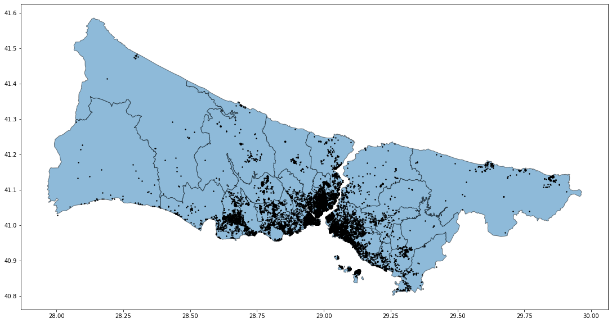

## İstanbul Airbnb Veri Haritası
**İnteraktif Harita**
<iframe src="https://berkaymbaskaya.github.io/harita/" height="500" width="750"></iframe>


### Çalışma
<p style="font-family:arial;"> 
Çalışmada istanbul İli içerisindeki Airbnb uygulamasında mevcut olan evlere dair ham veriler işlenmiş 
ve görselleştirilmiştir. Çalışmada  evler ilçe bazlı olarak gruplandırılmıştır. İlçelerdeki kiralık evlere
ait nitelikler imleçle ilgili ilçenin üzerine gelinerek sorgulanabilir. Ortalama günlük ev kirası
referans alınarak renklendirme yapılmıştır. Verilerin işlenmesi, görselleştirilmesi aşamalarında Python pandas, geopandas, folium kütüphaneleri kullanılmıştır.
Altlık olarak Openlayers kullanılmıştır.</p>
   

_Evlerin ilçeler üzerinde dağılımı aşağıdaki şekilde olduğu gibidir

```markdown
fig, ax = plt.subplots(figsize=(20, 10))
ilceler.plot(ax=ax,alpha=0.5, edgecolor="k")
evler.plot(ax=ax,color="black",markersize=2)

```
<a href="#"></a>

__Not:Çalışmada Kaan Kalkan Youtube kanalı, Mekansal Python oynatma listesinden faydalanılmıştır. İlgi duyanlar faydalanabilir.__
<a href=" https://www.youtube.com/c/kaankalkangeomatik" target="_blank"> Kaan Kalkan Youtube Kanalı </a><br> 
___________________Kullanılan tüm veriler <a href=" http://insideairbnb.com/get-the-data/ " target="_blank">Airbnb Veriler </a><br>
adresinden temin edilmiştir.
    
 
